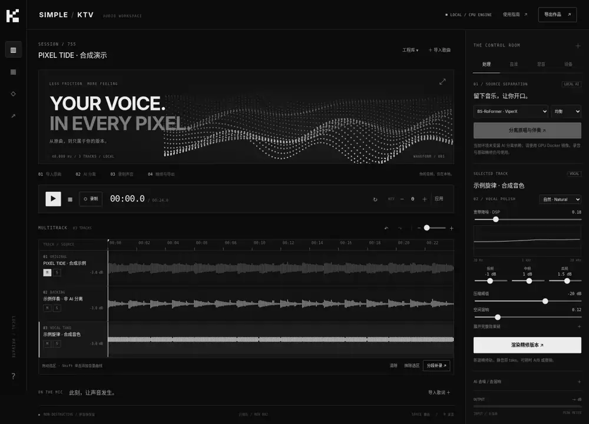

# SIMPLE / KTV

**YOUR VOICE. IN EVERY PIXEL.**

本地优先的黑白像素浪潮录唱工作台。导入歌曲，分离伴奏，变调录唱，再用可撤销的离线处理精修作品。



> **交付状态：0.1.1 / engineering preview。** 已实现真实后端和前端，不是静态设计稿。CPU 音频、API、修音/和声任务已有自动化验证；GPU RoFormer/TorchCREPE、Docker 镜像构建、真实麦克风与输出设备尚未在目标硬件验收。当前包不是已经调通的 5090 便携发行版，也不声称是已达到商业 DAW 完整度的成品。
>
> Windows 用户：完整解压后双击 **`start.bat`**。该版本用 Docker 隔离 AI 环境，不需要手工运行 PowerShell 命令；它不是预装所有模型的离线免安装包。

## 启动

Windows 推荐 Docker Desktop + WSL2 + 支持你的 GPU 的 NVIDIA 驱动。主机无需安装 Python、PyTorch、Node 或 CUDA Toolkit；首次 Docker 构建需要联网，模型首次运行也需要下载。CUDA 工具链/运行库在镜像内部。Docker 和显卡驱动本身仍需要先安装。

在解压后的根目录双击 **`start.bat`**，默认启用 NVIDIA GPU。它会检查本机 Docker/Compose、尝试打开已安装的 Docker Desktop、构建镜像、等待服务健康、执行真实 CUDA 矩阵运算和 Rubber Band R3 检查，然后打开 `http://localhost:7860`。失败不会伪装成功，也不会偷偷切到 CPU。

只体验无需神经模型的录音编辑、合成演示、DSP 调音/和声：双击 **`start-cpu.bat`**。

**停止：`stop.bat`；服务日志：`logs.bat`；重新诊断：`diagnose.bat`。** 启动器记录在 `logs/`，错误窗口会留屏。完整首次安装说明和排障见 [Windows BAT 指南](docs/WINDOWS.md)。

仍兼容原有命令：`powershell -ExecutionPolicy Bypass -File .\start.ps1`，CPU 参数为 `-CPU`。

Linux：`bash start.sh`；仅 CPU：`bash start.sh --cpu`。Linux GPU 需先配置 NVIDIA Container Toolkit。macOS 可使用 CPU 模式；不提供 Apple GPU 模型加速配置。

停止服务：双击 `stop.bat` 或执行 `bash stop.sh`。**停止不会清空录音、历史或模型缓存。** 不要执行 `docker compose down -v`，除非你确定要永久删除全部数据。

详见 [部署与排障](docs/DEPLOYMENT.md)。

## 工作流

1. **导入原曲**：拖入 MP3、WAV、FLAC、M4A 等；服务端真实解码为 48 kHz / stereo / float32。默认单文件 200 MB、20 分钟。原版歌曲保存为不可变资产。
2. **分离并选 Key**：选择 BS-RoFormer、MelBand 或两者 ensemble，运行本地模型。原版歌曲与参考原唱默认静音，只播放伴奏。变调范围 ±12 半音，不改变歌曲时长；每次从分离后的根资产重新渲染，不反复叠加变调损失。
3. **录唱**：设备页授权麦克风、选择输入；支持时可选择输出。默认关闭软件监听，建议耳机。预备拍后 AudioWorklet 只录制麦克风的 PCM，不把伴奏混入录音文件。输入设备断开会尝试结束录音。
4. **分段重来**：拖拽波形选择区域 → 分段补录。原 take 保留，覆盖区边界交叉淡化。提前停止的短录音只保留为独立 take，不替换原片段；上传失败保留可下载的 WAV。抹除不改变时间轴长度。
5. **精修**：选择干声 → 可选去噪/去混响 → 音高分析 → 调音 → 和声 → EQ / 压缩 / 齿音 / 空间效果。每次处理生成新轨并保留原轨，可 A/B、撤销、重做。
6. **混音导出**：调音量、声像、片段起点；Shift + 单击波形添加增益自动化节点。可自动做初始响度平衡。导出 WAV 24-bit、FLAC 24-bit 或 MP3 320 kbps，双遍 loudnorm，默认 −14 LUFS、−1 dBTP 目标。

## 功能边界

| 项目 | 当前实现 |
|---|---|
| 本地歌曲导入 | 真正解码、峰值/RMS、可视化真实波形；内置原创合成演示 |
| AI 原唱 / 伴奏分离 | 已编写 RoFormer 本地适配器、下载/缓存、模型溯源；**尚未实跑权重** |
| 变 Key | 原生 C++ Rubber Band **R3 双遍离线**、保留时长；不依赖神经网络 |
| 麦克风录制 | AudioWorklet 原始 float32 PCM，公共播放时钟，预备拍，手动对齐补偿；**真实硬件待验收** |
| 抹除、补录 | 选区抹除、交叉淡化补录、原始 take 保留、失败恢复、撤销/重做 |
| 音高曲线 | pYIN CPU / TorchCREPE neural F0；单音人声钢琴卷帘与原始/目标曲线 |
| 自动调音 | 按音阶吸附、强度、修正速度、手动音符区域；Praat PSOLA 重合成 |
| 自动和声 | 1–3 条**音阶级 DSP 和声**，独立声像/增益；**不是生成式 AI 歌手，也不理解整首伴奏和弦** |
| 后期处理 | 宽带 DSP 降噪、高通、三段 EQ、压缩、去齿音、混响、节拍关联延迟；另有未验收的 AI 去噪/去混响适配器 |
| 基础混音 | Mute/Solo、音量/声像、片段偏移、增益自动化、初始自动平衡、独立试听总音量 |
| 可视化 | 黑白像素波浪、音频响应、波形/选区/音高、输入输出表头、缩放、全屏歌词台 |
| 歌词 | 手动导入 LRC、同步显示；没有自动转录/强制对齐 |
| 工程 | SQLite 修订历史、持久化资产、任务取消/日志/错误、Range 音频读取 |

**没有以“最好”代替验证。** 本版固定的 ViperX/Kim 是可复现的已知基线，不是对 2026 最新 checkpoint 或所有歌曲最佳效果的保证。更新的 HyperACE、becruily 等候选及生成式 AI Harmonizer 的取舍见 [模型与算法调研](docs/RESEARCH.md)。当前“最前沿生成式自动和声”需求仍未完成。

## UI 操作

空格播放/暂停，R 录音，Esc 停止；输入框内不会抢占常规文字键。`Ctrl/Cmd + Z` 撤销，重做操作见工具栏。拖拽波形选区，单击定位；Shift + 单击添加增益节点。选区循环为应用层重新调度，不是专业级无缝 sample-accurate loop。

音高页先运行分析，再上下拖动音符设置目标音高，使用调音按钮渲染。大幅修正可能产生音色伪影；建议先小幅修正，并保留原始表达。音阶/BPM 当前需手动指定；歌曲转调或复杂和弦要手动分段判断，不能依赖固定音阶和声。

## GitHub 仓库

目标仓库：[Phantivia/SImple-KTV](https://github.com/Phantivia/SImple-KTV)。**本次连接器只完成初始化提交，后续批量源码写入被安全检查拦截，远端尚未包含完整应用。** 完整工程在交付 ZIP 内；本机执行 `upload.bat` 可通过你自己的 GitHub CLI 登录上传，并先显示变更、要求确认，不会 force push。

完成上传后，可使用 **Code → Download ZIP** 获取整个工程；或者：

```bash
git clone https://github.com/Phantivia/SImple-KTV.git
```

启动应用不需要 GitHub CLI 或 GitHub token；仅 `upload.bat` 需要已安装 Git/GitHub CLI，并在本机完成 `gh auth login`。已有工程数据由 Docker volume 保存，不要把录音、权重或密钥提交到公开仓库。旧的 `scripts/publish.*` 仅用于向**另一个不存在的仓库**发布全新副本；不用于更新本仓库。

## 测试与交付证据

[测试说明](docs/TESTING.md) 区分实际执行、桥接式界面检查、以及尚未执行的目标硬件测试。[JUnit 原始结果](docs/test-results/pytest.xml) 与 [前端 TAP 结果](docs/test-results/frontend.tap) 随包提供。

```bash
# 主机开发模式，需要自行安装 FFmpeg / librubberband >=3 / Python / Node。
pip install -r backend/requirements.txt -r backend/requirements-test.txt
npm --prefix frontend install --ignore-scripts
npm --prefix frontend run build
npm --prefix frontend test
python -m pytest
PYTHONPATH=backend python -m uvicorn app.main:app --host 127.0.0.1 --port 7860
```

不要用多 worker 启动；任务队列设计为单进程调度 + 每个任务独立子进程。

## 数据、安全与资源

音频不发送给推理云服务。首次下载模型会连接上游分发站点；仓库不携带或重新许可模型权重。所有录音和渲染版本留在 `simple-ktv_ktv-data` Docker volume，模型在 `simple-ktv_ktv-models`。工程清单 JSON 不是完整备份，完整备份必须包含数据库和音频资产。

这是**仅限本机、无账号认证**的服务。默认绑定 `127.0.0.1:7860`，有 Host / Origin / CSRF 保护，但不是公网部署方案。不要转发端口到公网。查看 [SECURITY.md](SECURITY.md)。

浏览器播放前会解码工程当前所有轨道，长歌曲/多版本可能占用大量内存。每个工程最多 64 轨；历史音频不会自动回收，磁盘会持续增长。没有崩溃中途录音的持续磁盘流式恢复，也没有专业 ASIO 驱动、实时变调/调音、VST 宿主、谱面级编辑、完整 DAW 工程互换。公开仓库不等于你有权公开导入的商业歌曲。

## 目录

```text
frontend/        TypeScript + Web Audio + Canvas / CSS；无运行时 npm 依赖
backend/app/     FastAPI、SQLite、不可变资产、DSP、模型与隔离任务
backend/tests/   API、真实音频、PSOLA、状态与取消回归
*.bat            Windows GPU/CPU 双击启动、停止、日志、诊断
scripts/         Windows 启动器、诊断、发布、自动化测试
Dockerfile       CPU / CUDA 12.8 GPU 多阶段镜像
compose*.yaml    本地端口、持久化 volume、GPU 配置
docs/           调研、架构、部署、测试报告、真实截图
```

许可证：应用代码 **GPL-3.0-or-later**；详见 [LICENSE](LICENSE) 与 [第三方声明](THIRD_PARTY_NOTICES.md)。模型权重、歌曲、声音和上游组件各自的许可独立适用。
